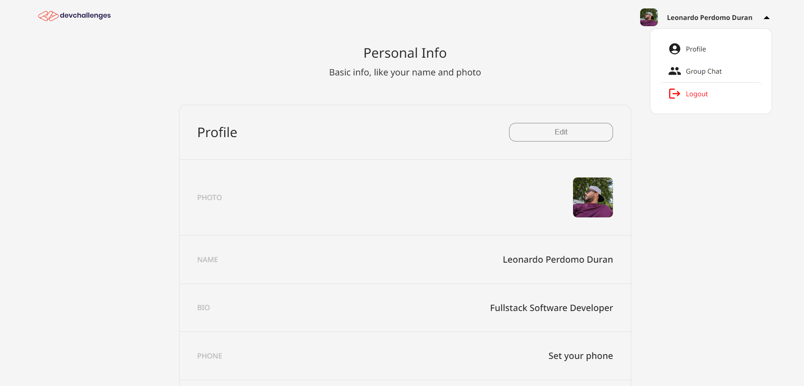
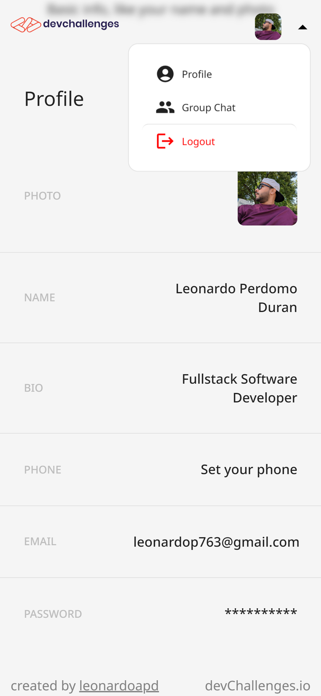

<!-- Please update value in the {}  -->

<h1 align="center">Authentication App</h1>

<div align="center">
   Solution for a challenge from  <a href="http://devchallenges.io" target="_blank">Devchallenges.io</a>.
</div>

<div align="center">
  <h3>
    <a href="https://auth-dev.netlify.app/">
      Demo
    </a>
    <span> | </span>
    <a href="https://github.com/leonardoapd/authentication-app-master">
      Solution
    </a>
    <span> | </span>
    <a href="https://devchallenges.io/challenges/N1fvBjQfhlkctmwj1tnw">
      Challenge
    </a>
  </h3>
</div>

<!-- TABLE OF CONTENTS -->

## Table of Contents

- [Table of Contents](#table-of-contents)
- [Overview](#overview)
  - [My Experience:](#my-experience)
  - [What I've Learned/Improved:](#what-ive-learnedimproved)
  - [My Wisdom:](#my-wisdom)
  - [Built With](#built-with)
- [Features](#features)
- [How To Use](#how-to-use)
- [Acknowledgements](#acknowledgements)
- [Contact](#contact)

<!-- OVERVIEW -->

## Overview




 
Hey there! Welcome to my project! You can check out the live demo of what I've built [here](https://auth-dev.netlify.app/).

### My Experience:
 This project has been an incredible ride from start to finish. I've poured my heart and soul into every line of code and every pixel of design. It's been a rollercoaster of emotions – from the excitement of a breakthrough to the frustration of a bug that just wouldn't budge. But every challenge has been a chance for me to grow.

### What I've Learned/Improved:
 I've learned more than I could've imagined. My web development skills have skyrocketed. I've dived deep into user experience design and learned how to create something that not only looks good but feels amazing to use. Project management has been another beast altogether – juggling timelines, tasks, and unforeseen hiccups. Through it all, I've improved my problem-solving abilities and my knack for staying calm under pressure.

### My Wisdom:

If there's one thing this journey has taught me, it's that every line of code and every pixel on the screen has a story to tell. Innovation is born from curiosity and the willingness to embrace the unfamiliar. Don't be afraid to push the boundaries of what you know. And remember, feedback is pure gold. It's a direct insight into how your creation is perceived by others.

### Built With

<!-- This section should list any major frameworks that you built your project using. Here are a few examples.-->

- [React](https://reactjs.org/)
- [React Router](https://reactrouter.com/)
- [Material UI](https://material-ui.com/)
- [Firebase](https://firebase.google.com/)
- [.NET](https://dotnet.microsoft.com/)
- [C#](https://docs.microsoft.com/en-us/dotnet/csharp/)
- [MongoDB](https://www.mongodb.com/)

## Features

<!-- List the features of your application or follow the template. Don't share the figma file here :) -->

This application/site was created as a submission to a [DevChallenges](https://devchallenges.io/challenges) challenge. The [challenge](https://devchallenges.io/challenges/N1fvBjQfhlkctmwj1tnw) was to build an application to complete the given user storie.

- [x] User story: I can register a new account
- [x] User story: I can log in
- [x] User story: I can log in or register with at least one of the following services: Google, Facebook, Twitter or Github
- [x] User story: I can sign out
- [x] User story: I can see my profile details
- [x] User story: I can edit my details including: photo, name, bio, phone, email and password
- [x] User story: I can upload a new photo or provide an image URL

## How To Use

<!-- Example: -->

To clone and run this application, you'll need [Git](https://git-scm.com) and [Node.js](https://nodejs.org/en/download/) (which comes with [npm](http://npmjs.com)) installed on your computer. From your command line:

```bash
# Clone this repository
$ git clone https://github.com/leonardoapd/authentication-app-master

# Install dependencies
$ npm install

# Run the app
$ vite
```

## Acknowledgements

<!-- This section should list any articles or add-ons/plugins that helps you to complete the project. This is optional but it will help you in the future. For example -->

- [Steps to replicate a design with only HTML and CSS](https://devchallenges-blogs.web.app/how-to-replicate-design/)
- [Marked - a markdown parser](https://github.com/chjj/marked)

## Contact

- Portfolio [leonardo-perdomo](https://leonardo-perdomo.netlify.app/)
- GitHub [@leonardoapd](https://github.com/leonardoapd)
- Twitter [@leonardoapd](https://twitter.com/leonardoapd)
